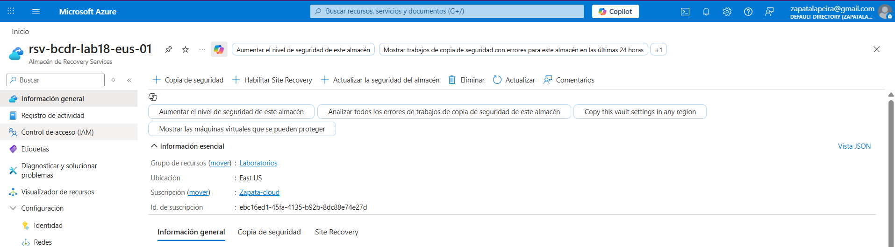
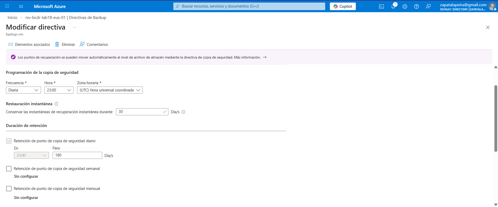
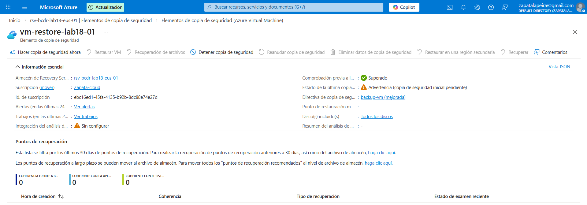
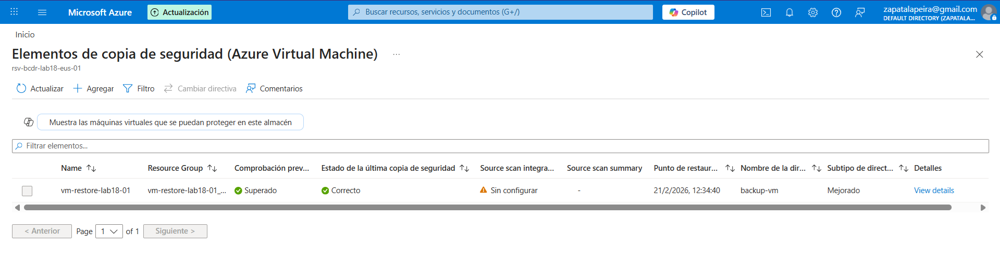
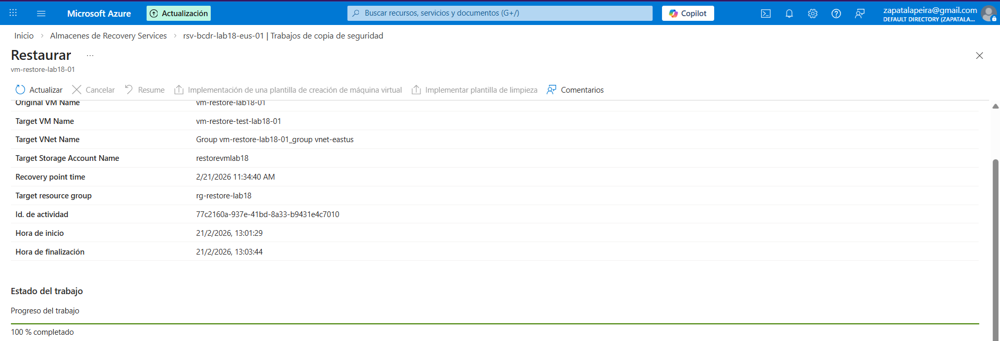
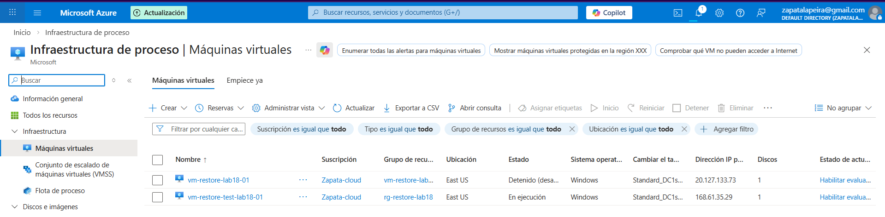

# Lab 18: Continuidad de Negocio con Azure Backup (Recovery Services Vault)

## Objetivo
Configurar copias de seguridad de una máquina virtual (VM) en Azure con **Azure Backup** usando un **Recovery Services Vault (RSV)** y, lo más importante, **validar la restauración**.

> **Cloud key idea:** Un backup “activado” no sirve si nunca se prueba un restore.  
> En este lab se deja evidencia de **Recovery Point** y de un **restore real** creando una VM nueva.

---

## Escenario
Quiero proteger una VM con copias diarias:
- Creo un **Recovery Services Vault (RSV)**.
- Defino una **política diaria** con retención.
- Habilito backup en la VM con esa política.
- Lanzo un **Backup now** para generar el primer **Recovery Point**.
- Hago un **restore de prueba** restaurando la VM en **otra VM nueva** (sin tocar la original).

---

## Servicios utilizados
- **Recovery Services Vault (RSV)**
- **Azure Backup** (gestión de copias, recovery points y restores)
- **Azure Virtual Machines**

---

## Recursos del lab (valores usados)
- **Región:** East US  
- **VM protegida (original):** `vm-restore-lab18-01`  
- **Política:** `backup-vm`  
- **Restore (VM nueva):** `vm-restore-test-lab18-01`  
- **Resource Group del restore:** `rg-restore-lab18`  
- **Red/Subred:** `vnet-eastus-1` / `snet-eastus-1`  
- **Redundancia del vault:** **LRS (Local)** (opción más barata, ideal para labs)

> **Nota:** Azure Backup **no borra** la VM original cuando restauras.  
> La restauración se hace “en paralelo” (VM nueva) para validar y decidir el cutover sin riesgo.

---

## Evidencias (capturas)

### 01) RSV creado

### 02) Política diaria y retención

### 03) VM protegida (Protected item) + estado

### 04) Recovery Point (última copia “Correcto”)

### 05) Restore ejecutado (job y parámetros)

### 06) Resultado restore (VM restaurada creada)

---

## Pasos realizados (procedimiento)

### 1) Crear el Recovery Services Vault (RSV)
1. Crear un **Almacén de Recovery Services** en **East US**.
2. Seleccionar **Redundancia local (LRS)** para minimizar costes.
3. Verificar que el vault queda accesible.

Resultado: RSV listo y visible en el portal.

---

### 2) Crear una política diaria de backup
1. En el RSV, crear política para **Azure Virtual Machine**:
   - Frecuencia: **Daily**
   - Retención: definida en la política (lab)
2. Guardar como `backup-vm`.

Resultado: Política creada y disponible para asignarla a la VM.

---

### 3) Habilitar backup en la VM con esa política
1. En el RSV, habilitar copia de seguridad para la VM `vm-restore-lab18-01`.
2. Seleccionar política `backup-vm`.
3. Confirmar que la VM aparece como **elemento protegido**.

Resultado: VM en estado protegido y asociada a la política.

---

### 4) Ejecutar “Backup now” y validar Recovery Point
1. En el elemento protegido, ejecutar **Hacer copia de seguridad ahora (Backup now)**.
2. Verificar en la vista del elemento que:
   - **Última copia de seguridad** = Correcto
   - Existe al menos **1 punto de restauración (Recovery Point)**

Resultado: Recovery Point creado y visible.

---

### 5) Restore de prueba (validación real)
En este lab se realiza un restore **sin tocar la VM original**:

1. Iniciar restauración desde el RSV usando el Recovery Point.
2. Tipo de restore: **Recover VM to an alternate location** (crear VM nueva).
3. Datos de destino usados:
   - VM nueva: `vm-restore-test-lab18-01`
   - RG destino: `rg-restore-lab18`
   - Red/subred: `vnet-eastus-1` / `snet-eastus-1`
4. Se selecciona una **cuenta de almacenamiento provisional (staging)** para el proceso de restore.
   - Importante: el staging **no es** donde “viven” los backups; los recovery points se gestionan por el servicio de Azure Backup.  
   - La storage account se usa como **zona temporal** durante la restauración y para limpieza automática en caso de fallo.

Resultado: Restore completado al 100% y VM restaurada creada y en ejecución.

---

## Checklist de verificación
- [x] RSV creado y accesible (East US)
- [x] Política diaria `backup-vm` configurada
- [x] VM `vm-restore-lab18-01` aparece como **Protected**
- [x] Existe al menos **1 Recovery Point** (última copia: Correcto)
- [x] Restore probado creando VM nueva `vm-restore-test-lab18-01` en `rg-restore-lab18`

> 🟦 **Cloud conclusion:** Se valida continuidad de negocio porque hay **Recovery Point** y un **restore real** documentado.

---

## Notas prácticas (cosas reales que suelen fallar)
- Un backup sin pruebas de restore **no es** continuidad de negocio.
- Restaurar como VM nueva es el patrón seguro: validas sin romper producción.
- **Soft Delete** tiene mínimos (no permite “0 días”): Azure obliga a un rango (ej. 14–180).
- En empresa se complementa con:
  - **RBAC mínimo** (evitar que cualquiera desactive backup o borre el vault)
  - **Locks** (CanNotDelete) sobre vault/RG
  - **Alertas/monitorización** de jobs fallidos
  - Elección de redundancia (LRS vs GRS) según RPO/RTO y presupuesto

---

## Plan B: Restore de discos (en lugar de restaurar la VM completa)
Además del restore de VM, Azure Backup permite restaurar **solo los discos**:

**Cómo funciona:**
1. Seleccionas un Recovery Point.
2. En lugar de “crear VM nueva”, eliges **Restore Disks**.
3. Azure crea **managed disks** (OS disk y/o data disks) en un RG destino.

**Qué haces después:**
- Adjuntas el **data disk** restaurado a una VM de rescate para recuperar archivos, o
- Creas una VM a partir del **OS disk** restaurado.

**Cuándo se usa:**
- Recuperación “quirúrgica” (solo datos), investigación, o cuando quieres máximo control.

---

## Qué le diría a un cliente / en entrevista
“Azure Backup no es solo activarlo: defines política y retención, monitorizas jobs y **pruebas restores**.  
En este lab dejo evidencia de un Recovery Point y un restore real creando una VM nueva para validar recuperación sin afectar a la VM original.”

---

## Limpieza (para evitar costes)
- Eliminar la VM restaurada `vm-restore-test-lab18-01`
- (Recomendado) Eliminar el **Resource Group** `rg-restore-lab18` para borrar todo de una vez.
- Revisar recursos sueltos si quedara alguno: discos, NIC, IP pública.
- Si vas a desmontar todo el lab: detener protección y eliminar el RSV siguiendo el orden correcto (evitando bloqueos por Soft Delete).
